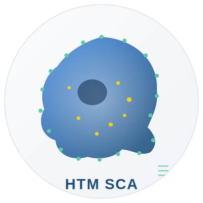

# HTM-Simple-Cell-Analyzer
HTM SCA (HTM Simple Cell Analyzer) is a lightweight, browser-based image analysis tool designed for rapid morphological assessment of single cells in grayscale holotomographic microscopy images.
# HTM SCA — HTM Simple Cell Analyzer

<p align="center">
  
</p>

<p align="center">
  <strong>Minimal browser-based tool for morphological analysis of single cells in grayscale holotomographic microscopy images.</strong>
</p>

<p align="center">
  <a href="#live-demo">Live demo</a> ·
  <a href="#features">Features</a> ·
  <a href="#quick-start">Quick start</a> ·
  <a href="#how-it-works">How it works</a> ·
  <a href="#limitations">Limitations</a> ·
  <a href="#citation">Citation</a>
</p>

---

## What it does

HTM SCA is a single-file HTML application for rapid cell morphology assessment of holotomographic microscopy images. It runs entirely in your web browser — no installation, no server, no data upload. All image processing happens locally on your computer.

Given a grayscale PNG or JPG image, the tool segments the main cell body, outlines its contour, measures its shape, and optionally detects bright intracellular granules. Results are exported as a CSV file ready for statistical analysis in GraphPad, R, or Excel.

<p align="center">
  <em>A fast, transparent first-pass tool for researchers working with Nanolive, Tomocube, or similar label-free microscopy platforms.</em>
</p>

---

## Live demo

Open the application directly in your browser:

**→ [Launch HTM SCA](https://julitakul.github.io/HTM-Simple-Cell-Analyzer/)**


---

## Features

- **Zero installation** — open a single HTML file in any modern browser
- **Fully local processing** — images never leave your computer; suitable for unpublished experimental data
- **Interactive threshold adjustment** with live preview (auto-runs 250 ms after slider release)
- **Cell segmentation** using percentile-based thresholding with background subtraction and border exclusion
- **Shape measurements**: area, perimeter, bounding box, aspect ratio, circularity, solidity, mean intensity
- **Three-category shape verdict**: near-circular · moderately irregular · clearly irregular
- **Optional granule detection** inside the cell mask (count, mean area, mean intensity)
- **Toggleable overlays**: binary mask, cell contour, detected granules
- **CSV export** of all numeric results, named after the input image
- **~40 KB single HTML file** — works offline, easy to archive and share

---

## Quick start

### Option 1 — use the live demo

Just open the live link above and upload a PNG or JPG.

### Option 2 — download and run locally

```bash
git clone https://julitakul.github.io/HTM-Simple-Cell-Analyzer/
cd htm-sca
# Open simple_cell_analyzer.html in your browser
```

On macOS/Linux: `open simple_cell_analyzer.html`
On Windows: double-click the file

### Option 3 — embed in your website

```html
<a href="simple_cell_analyzer.html" target="_blank" rel="noopener">
  
</a>
```

---

## How to use

1. **Upload** — drag a PNG or JPG onto the upload area, or click to select a file. Images are automatically downscaled to 500 px on the longest side.
2. **Adjust parameters** if needed:
   - **Threshold** (default 0.80) — higher = only brightest pixels counted as cell
   - **Background blur** (default 8) — radius for background subtraction
   - **Granule sensitivity** (default 0.25) — higher = fewer, brighter granules detected
3. **Click "Run Analysis"** — results appear within one second
4. **Inspect** the overlay with the three display toggles (mask, contour, granules)
5. **Tune** the threshold slider for live preview — analysis re-runs automatically
6. **Export** results as CSV when satisfied

---

## How it works

HTM SCA uses a lightweight classical image-processing pipeline — no machine learning, no WebAssembly, no external libraries. The full pipeline runs in under one second on a 500×500 image:

1. **Grayscale conversion** — RGB image converted to luminance
2. **Separable box blur** — fast O(n) filter for noise smoothing
3. **Background subtraction** — high-pass filter (original minus blurred) removes illumination gradients
4. **Percentile threshold** — sorts pixel intensities and cuts at a user-defined percentile (robust to bright outliers)
5. **Connected-component labelling** — 4-connectivity flood fill identifies distinct regions
6. **Border exclusion** — components touching the image edge are deprioritized to avoid selecting background
7. **Hole filling** — interior gaps in the cell mask are closed via border-BFS
8. **Boundary extraction** — edge pixels identified from the mask
9. **Shape measurements** — standard formulas: circularity = 4π·area/perimeter², solidity = area/bbox_area
10. **Granule detection** — local contrast threshold inside the cell mask + size-capped BFS grouping

The tool is deliberately designed to be **transparent and easy to modify**. All parameters are exposed as sliders, and the JavaScript source code contains inline comments marking every tunable constant.

---

## Scientific framing

HTM SCA is designed to respect the boundary between **measured morphology** and **inferred biology**:

- **What the tool measures directly** (report without qualification): cell area, perimeter, circularity, solidity, aspect ratio, bright intracellular puncta count
- **What the tool cannot confirm** (not included in the output): cell viability, apoptosis state, lysosome identity, vesicle class, mitochondrial status

These biological interpretations require orthogonal validation with confirmatory assays (Annexin V, caspase activity, PI exclusion, MitoTracker, LysoTracker, electron microscopy). HTM SCA is a morphology screening tool, not a replacement for specialized platforms such as Nanolive EVE Analytics or CellProfiler.

---

## Parameters you can tune in the source code

The three sliders are the main user controls. For power users, these constants in `simple_cell_analyzer.html` have the highest leverage:

| Location | Constant | Effect |
|---|---|---|
| `onFile`, `MAX_DIM = 500` | Downscale target | Raise for more detail (slower), lower for more speed |
| `runAnalysis`, verdict thresholds `0.78` and `0.55` | Shape interpretation cutoffs | Tighten if your cells are typically rounder |
| `runAnalysis`, `MIN_G = 2, MAX_G = 60` | Granule size range (pixels) | Raise `MAX_G` for larger bright spots |
| `runAnalysis`, `granBG` blur radius `5` | Granule local-contrast scale | Larger = catches bigger spots, smaller = tighter puncta only |

---

## Limitations

- **Single image per session** — no batch processing or time-series analysis
- **Single cell selection** — images with multiple separate cells will report metrics for only the largest interior object
- **Percentile threshold** may fail on images with extreme intensity gradients; manual slider adjustment required
- **2D projection only** — does not use the full 3D refractive index information available in raw holotomographic volumes
- **Granule detection is simple** — uses a local-contrast threshold and does not distinguish vesicle types, lipid droplets, or acquisition artifacts
- **JPEG compression artifacts** can be mistaken for texture; prefer PNG export when possible

---

## Citation

If you use HTM SCA in your research, please cite:

```
Kulbacka J. et al. (2026). HTM SCA: HTM Simple Cell Analyzer (v1.0).
GitHub. https://github.com/YOUR-USERNAME/htm-sca
```

A Zenodo DOI will be added when a stable release is tagged.

### Recommended methods text

For publications using HTM SCA output:

> Cell morphology was analyzed using HTM SCA v1.0 (https://julitakul.github.io/HTM-Simple-Cell-Analyzer/).
> Images were converted to grayscale, background-corrected using a rolling box-blur
> subtraction (radius 8 px), and cell regions identified by percentile thresholding of
> the residual image. The largest non-border-touching connected component was selected
> as the cell. Circularity was computed as 4π·A/P².

---

## Funding

<p align="center">
  
</p>

This research was funded by the Medical Research Agency, grant no.
**2024/ABM/03/KPO/KPOD.07.07-IW.07-0072/24-00**.

The project is implemented under the National Recovery and Resilience Plan (Krajowy Plan Odbudowy), co-funded by the European Union's NextGenerationEU instrument.

---

## Technical notes

- **No dependencies** — pure HTML5, JavaScript, Canvas API
- **Supported browsers**: Chrome, Firefox, Edge, Safari (any version from 2019 onwards)
- **File size**: ~40 KB single HTML file
- **Input formats**: PNG, JPG (grayscale microscopy images)
- **Output formats**: CSV
- **Maximum image size**: automatically downscaled to 500 px on longest side
- **Runtime**: < 1 second per image on a standard laptop

---

## Contributing

Issues and pull requests are welcome. The codebase is deliberately small and readable — start with `simple_cell_analyzer.html` and look for the `TUNABLE` comments.

For substantial feature additions (batch processing, time-series, advanced segmentation), please open an issue first to discuss scope. HTM SCA is intentionally lightweight, and the project will remain focused on that design philosophy.

---

## License

MIT License — free for academic and non-commercial research use.

[](LICENSE)
See [LICENSE](LICENSE) for full terms.

---

## Contact

Prof. Julita Kulbacka
Department of Molecular and Cellular Biology, Faculty of Pharmacy
Wroclaw Medical University, Poland
julita.kulbacka@umw.edu.pl
